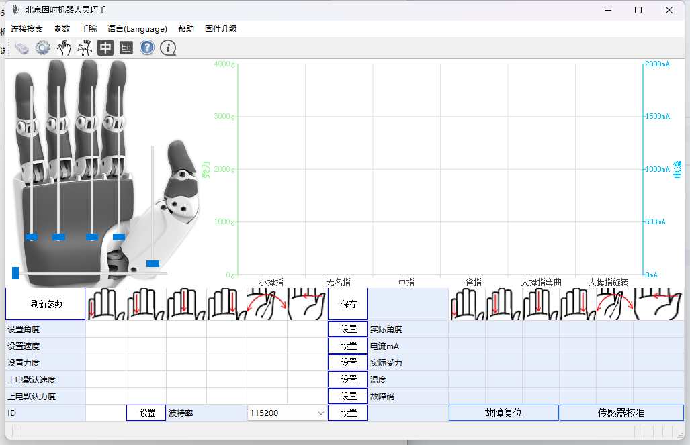
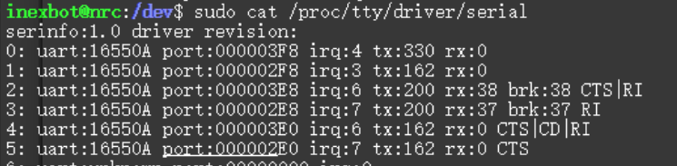
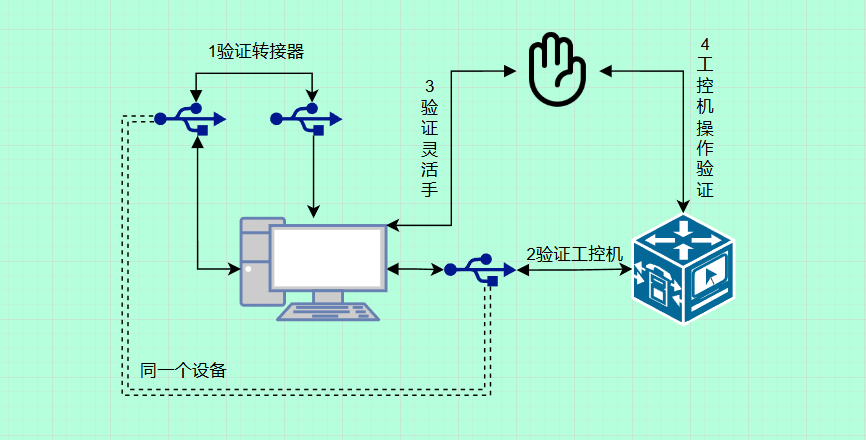
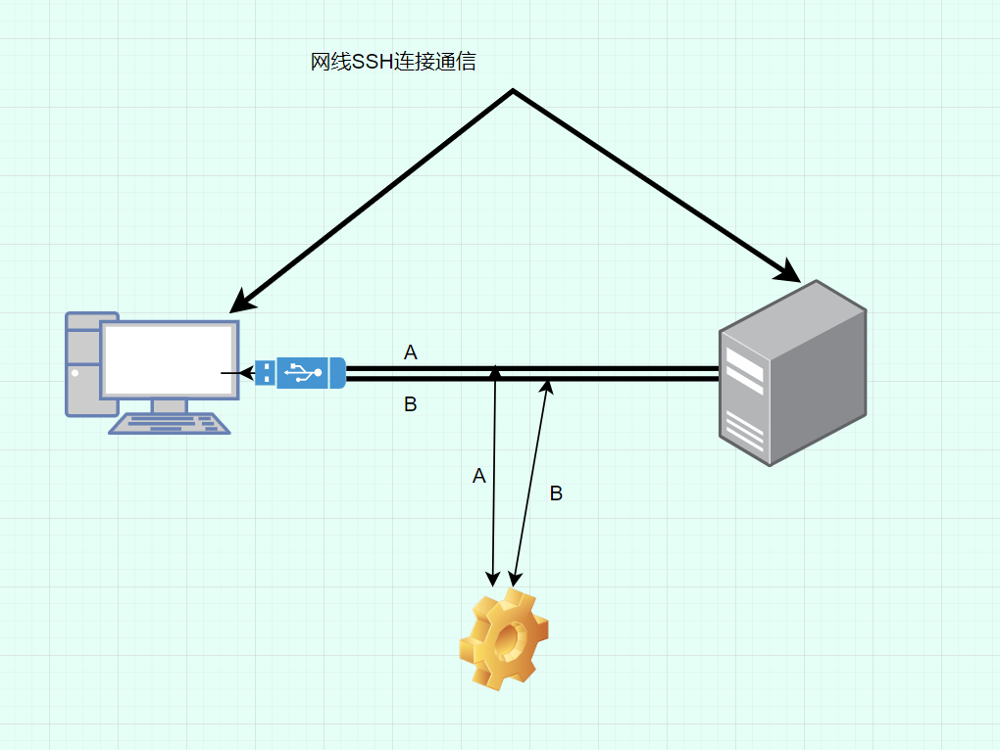
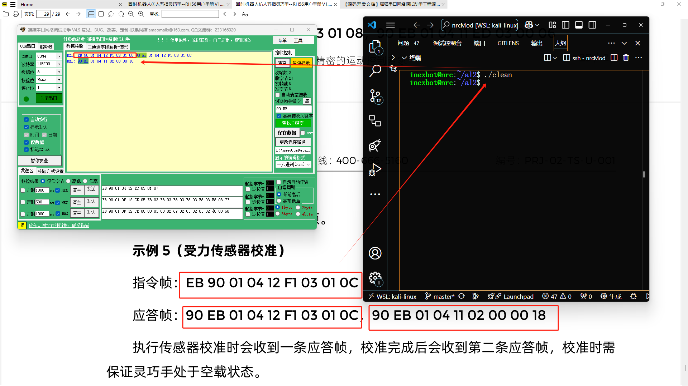
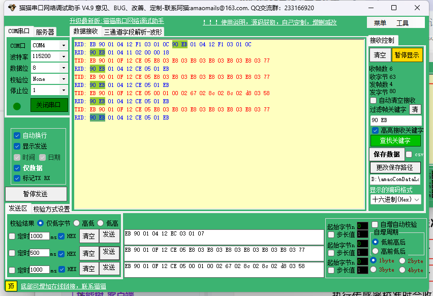

<!-- Cover image source: [alt text](image.png) -->

# 记录一下关于 `rs485`协议开发灵巧手遇到的所有问题  

# 1. 验证灵巧手是否通电
1. 通电后左手大拇指根部,机械结构缝隙露出红光或者绿光证明通电成功

# 2. 验证灵巧手能接收到内容
首先我们要确定我们能发送出去内容
	## 2.1. 验证我们可以发出rs485的内容
从设备出口出发 我们需要知道 转接器是否能够发送出去内容
+ 硬件接线是 A对A B对B 确定颜色就好
+ 对于机器人 来说 黄A 蓝B 黑或棕接地
+ **RS485 通信是通过两根信号线的高低电平差来读取内容 这意味着不能通过短接AB来看数据是否发送**

这里我想到的思路是 
```
USB->RS485 ------------------->>>>>-----------------RS485->USB
此处的2个USB都连在一个电脑上, 开启两个串口
```

RS485 通信时 双向半双工的 依次确定能否发送数据   避免转接器的问题导致后续问题不方便排查
> [!NOTE]
> 小贴士: 一般情况(不绝对)下,转接器会发送和接收内容,会有不同的闪光,也可以辅助查看数据的通信情况

## 2.2. 驱动问题
关于转接器, 我们还需要考虑驱动问题, 不见得所有的设备都只是用 ch340 或者 ch341 就能对串口进行操作
注意查看转接器包装是否提供了 驱动下载链接
也可以直接导致 *数据不能发送*

---
> 至此, 硬件连接问题解决, 驱动问题解决,下一步验证灵巧手能否响应内容

---


## 2.3 win平台下上位机使用 或 调用串口
灵巧手提供了开发的上位机程序,值得注意的是,*串口在同一时间通常只能被一个进程打开*,意味着其他串口工具和通信方式要关闭
在没有阅读 参数列表的时候 建议使用上位机控制 避免特殊符号或者误触导致的 无响应


这里非常建议使用 可以拉去左侧进度条 或者 传感器标准(使用前记得连接搜索)
或者按照文档 串口发送内容 
EB 90 01 04 12 F1 03 01 0C
这个校准期间 尽量不要接触 灵巧手

---
> 至此 我们证明了灵巧手的响应没有问题了

---
# 3. 如何利用工控机操作RS485串口
+ linux 上一切内容皆文件, rs485 也将映射到 文件中 一般考虑如下几个文件 `/dev/ttyS0~5`
+ 这里主要看 ttyS0 和 ttyS1
+ 众所周知, /dev 目录下很多文件 都是字符设备映射文件 跟普通的文件操作上略有不同
## 3.1. 如何证明我们对串口发送了数据呢 ?
```shell
	sudo cat /proc/tty/drive/serial
```
这个命令会记录这个串口 发送和接受的数据

每次尝试发送后 查看tx后面的数值是否发生变化

## 3.2. 如何给这个串口发送数据呢?
+ 串口的字符文件描述符有如下特点
+ 丰富的标志位需要设置,下面会提到
+ 这些标志位每次重启后,都会丢失会被初始化为原本的样子,需要设置
+ 我们发送内容也应当注意 波特率 数据位 停止位 完整性校验方法等
+ 字符设备的操作区别于普通文件, 他不具备缓冲区, 是以流的方式运行的,只能存储单个字符
	+ 而不是所有操作工具 都有针对这种场景适配 因此一些基础工具可能不太好用
	+ 这里的字符设备 要注意跟上面的串口一样 也具备一些独占的属性
### 3.2.1. 有哪些参数需要预设呢?
```shell
  stty -F /dev/ttyS1 115200 cs8 -parenb  -cstopb  -ixon -ixoff
```
具体参数内容,没有细察,可以后期补充,项目紧急草草过下
> 如果后需要代码开发,系统编程提供了合适的内容支持

### 3.2.2. 发送数据
建议使用 工具 screen 
+ 先说说怎么退出,这个程序的退出比较复杂,类似 vim , 如果没有正常退出释放字符设备,就会被独占不能操作
	+ 首先  ctrl+a 进入命令模式 然后 `:quit` 输入命令 就可以退出了
	+ 如果不小心命令行被关掉或者其他方式关掉, 这个进程可能还会保留在后台不会死
	+ `screen -ls`  查看存活的内容
	+ `screen -X -S <session_id> quit`  这里id 替换成 上面查到的4~5位的数字id就好
	+ 可以再次查看存活状态
+ 下面正式开始 怎么打开这个会话
```shell
screen /dev/ttyS1 <波特率>
```
然后会出现一个黑框,你所有的键盘内容都会实时输入进去,没有回显
+ 这里建议工控机和开发机器的网线和485通道都打开
+ 也就是 网线保证 ssh 的信道通信
+ 485 通道 在开发机器 打开UBS转485的串口 接收数据

> 如果说我们能够顺利的发送了数据, 开发机器的串口工具也准确的收到了内容,那么我们证明了 工控机的RS485 和 设备挂载是没有问题的
> 关于接收到的内容 输入的内容会默认为字符串 会被转换成ASCII码  然后会转为16进制内容  也就是说 
+ 如果 发送键盘上的 0  对面是 0x30
+ 发送1 对应 0x31
+ 发送A 对应 0x41   -> 也就是65

然后也可以给工控机发送数据   内容会直接打印出来  应该是自动有做转码处理  会直接输出明文
> [!CAUTION]
> 如果是乱码,记得详细查看 A对A  B对B  不要接反

---
总结一下 我们验证了 如下内容
1. 开发机器的串口发送能力
2. USB转RS485 的设备健康
3. 机器手的接收和发送能力
4. 机器手的动作能力
5. 工控机的串口发送能力和接收能力



---
# 4. 是否发送?发送了什么?
针对3.1章节 我们有提到 我们确定自己发送了数据,但是这仅仅是针对于发送方.
假设我们跳过了前面的部分,在此处发送内容依旧可以显示内容? 但是如何证明 如下几点:
1. 我发送的东西有通过线路出去了呢(前面提到USB转RS485转接器可以依稀看到)
2. 我们发送出去的内容是我们原本的意思吗? 会不会字符串转了ascii码或者以错误的格式发送了出去
3. 有些上位机的功能 我不知道怎么实现的 我能不能知道上位机发送了哪些东西 ~~抄~~借鉴一下

## 4.1. 理解通信场景
目前来看, 我们的开发目的是单线通信的方式,有什么内容的对话只有工控机和灵巧手之间知道.
而且对于工控机(这里pc也一样)来说串口这个东西将会被独占,不方便(也许系统调用或者ebpf可以)从软件层面进行监控.
那么我们从硬件层面考虑,将其中的硬件通信构建一个广场,让他们之间的对话完全成为一个公开的内容
> [!CAUTION]
> 这里的全部操作断电操作
1. 首先我们将pc端的转接口A对准工控机的接口A,对应的B对应B
2. 然后对连接的电线 开环- 将其中一部分的塑料皮剥开 然后将灵巧手的信号线并联上 注意! 依旧是A对A B对B
线路连接 大致如下


如此一来,我们能将得到一个广播广场,效果如下
1. PC上位机发送的所有内容 + 灵巧手给的响应 工控机都可以监听到(不过上位机发送内容超级频繁,需要使用过滤工具)
2. 工控机发送的所有内容 + 灵巧手的响应 PC都可以通过串口调试工具监听到
3. 工控机给了错误的指令 导致灵巧手故障 上位机可以快速清理故障以及复位
4. 因为任何原因导致 工控机的参数 实质上没有对外发送 也可以看到
5. 串口调试助手可以快速 试验 命令帧
6. 避免了频繁的接线问题

## 4.2 新场景是否引入了问题
目前来看,新的通信方式更多的是带来优势.
但是引入了一些小问题 以及对于一些已有问题,我们更加清晰
+ 对于单个发送端也就是单个pc或者工控机而言, 串口是独占的, 在软件层面, 但是我们开发的过程如果无意多开或冲突会引发什么问题呢 
	+ 基本无法预知.
	+ 对于pc,我们无需过多关注 串口工具和上位机的无法连接,会提醒我们
	+ 对于工控机,我开发了一个小脚本,用来自动清理冗余进程的小脚本 
```shell
#!/bin/bash

# 检查是否以 root 用户运行
if [ "$EUID" -ne 0 ]; then
  echo "请以 root 用户运行此脚本。"
  exit 1
fi

# 获取占用 /dev/ttyS1 的所有进程 ID
pids=$(sudo lsof /dev/ttyS1 | awk 'NR>1 {print $2}')

# 如果没有进程占用，则退出
if [ -z "$pids" ]; then
  echo "没有进程占用 /dev/ttyS1。"
  exit 0
fi

# 杀死所有相关进程
echo "正在杀死以下进程："
echo "$pids"
kill -9 $pids

# 检查是否成功
if [ $? -eq 0 ]; then
  echo "所有占用 /dev/ttyS1 的进程已成功终止。"
else
  echo "终止进程时出错。"
  exit 1
fi
```

+ 对于pc和工控机的使用场景, 这句话可以改为 “通常情况下，应避免 PC 上位机和工控机同时向灵巧手发送指令，**除非在排错过程中**
## 4.3 如何通过pc串口工具监听通信呢?

这里写了个受力传感器的例子
1. 被ssh连接工控机发送指令后 灵巧手会有2个响应 一个立即响应开启动作 另一个动作完成
2. 从串口调试助手这边来看 接收到 看似2条指令 
	1. 第一条略长 因为对于pc来说 工控机发送和灵巧手的响应 都是接收者
	2. 第二条略短 是灵巧手的动作完成响应
> 这里由于是连续的 个人建议 通过串口调试工具的过滤功能分段
+ 直接搜索 90 EB 这里是 接收包的包头 那么此处之前的内容 就是发送方的内容
如果使用串口快速测试一下帧内容 则可以

更清晰的区分发送方和接收方


## 如何通过PC工控机监听上位机通讯?
```shell
cat /dev/ttyS1 | od -t x1 -v
...
0714220 94 06 04 03 fe 06 a4 04 64 0b f2 ff ff ff 80 80
0714240 fe ec ff ff ff ff 00 00 00 04 04 04 04 04 04 04
0714260 04 04 04 04 04 04 04 04 04 04 04 24 24 24 24 24
0714300 24 24 e0 e0 62 1e 22 bd eb 90 ff 04 11 0a 06 4e
0714320 72 d8 c0 fe 66 ec 8c f0 fe 30 70 ff f8 ff 18 e0
0714340 0e bc 0e 0c 07 e6 07 3e 06 36 6f f6 ff 8c 80 80
0714360 80 ff ff 84 80 84 80 80 80 80 80 80 80 80 80 00
0714400 80 80 00 80 00 00 80 00 00 03 02 02 02 02 06 20
0714420 20 26 20 1e 24 a4 eb 90 ff 04 11 0a 06 4e 72 90
0714440 eb 01 51 11 0a 06 e8 03 e7 03 e8 03 e6 03 e7 03
0714460 dc 03 8f 00 99 00 a0 00 9f 00 08 00 a7 01 fe ff
0714500 ff ff fe ff 0c 00 ff ff 00 00 fe ff ff ff fe ff
0714520 00 00 ff ff 00 00 00 00 00 00 00 00 00 00 00 00
0714540 00 00 00 00 00 00 00 00 02 02 02 02 02 06 20 20
0714560 20 20 1e 20 a6 eb 90 ff 04 11 0a 06 4e 72 90 eb
0714600 01 51 11 0a 06 e8 03 e7 03 e8 03 e6 03 e6 03 dc
...
```
可以通过列处理工具 全部导出 然后通过 eb 90 和 90 eb 关键字
将命令的发送帧和接收帧 再可以通过自己针对功能的设定参数 进行二次过滤 即可

