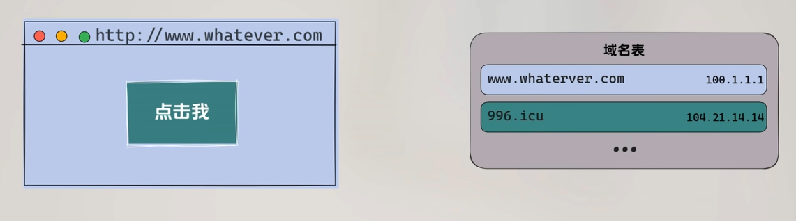
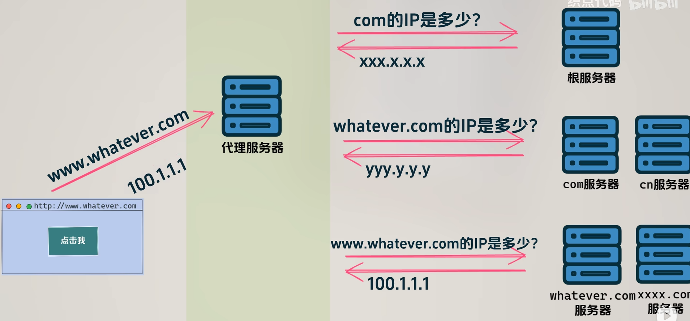
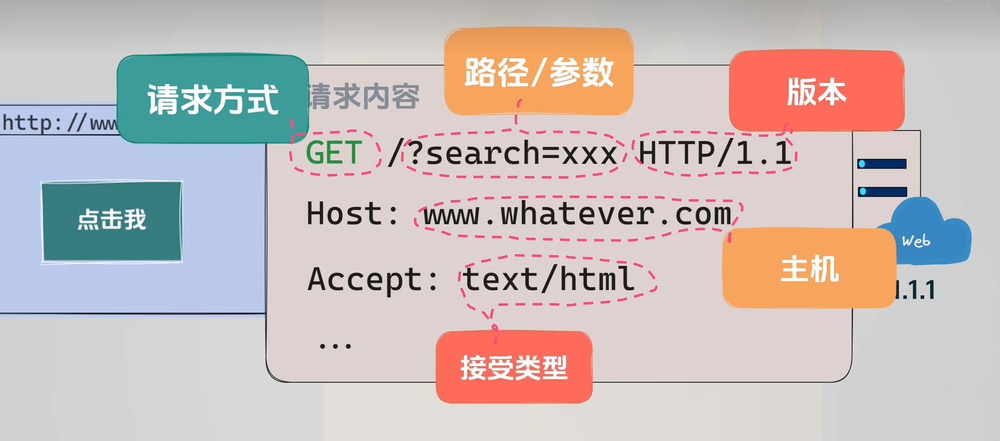
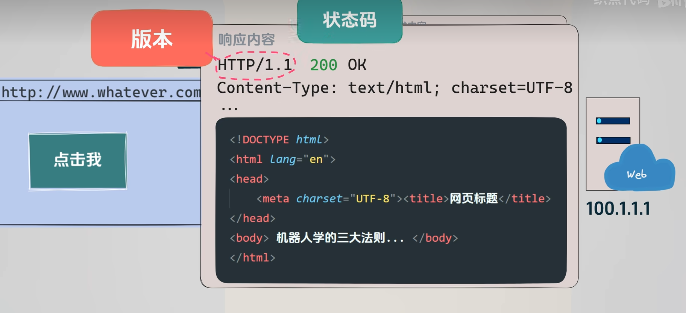
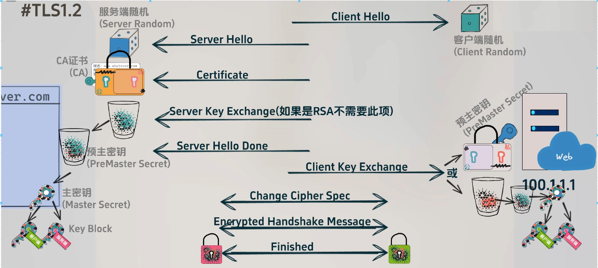
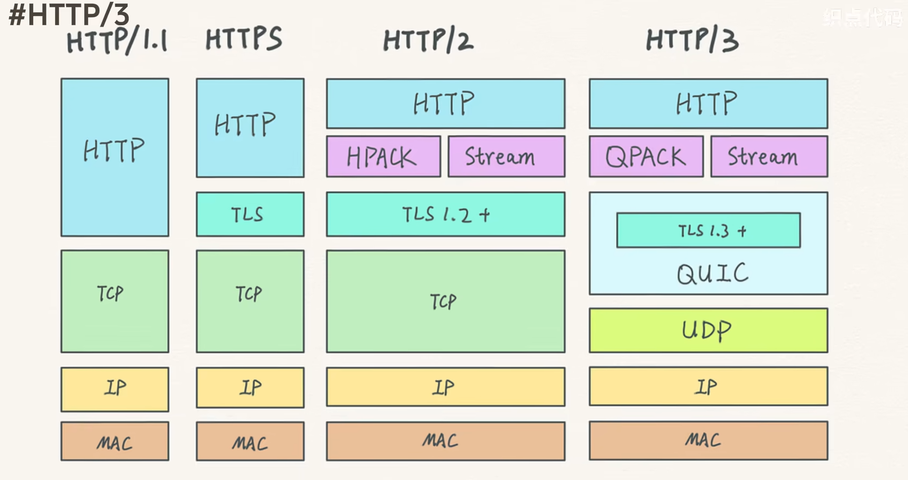

> 前缀知识, TCP/IP协议

## DNS协议
本文将探讨互联网最常见的http请求的完整流程,首先我们了解到早于 http3.0 之前, 协议使用的TCP的网络协议,可以根据 源ip端口+目标IP端口+协议的方式 进行网络通信. 考虑到ip和端口都是数字不便记忆,域名便成为了主要的操作参数. 于是我们可以建立一个类似电话本的方式,映射域名和ip+端口的方式.

对于一个 linux 客户的机器, /etc/hosts 文件就是这个电话本

但是从实际考虑, 这个表的内容完全有可能更新,频繁的更改本地这个文件是不现实的. 而且考虑到我们的网络安全情况,这个文件在系统中有很高的权限,不会允许普通用户进行改动,所以我们的实际用到的映射信息在其他的文件中 可以通过命令查看, 我们的浏览器一般也会单独缓存一份.

然而本地存储全球所有的域名表这并不现实, 即使使用一个完整的机器存储压力也是很大的, 而且并不适用于跨设备共享, 所以会有组织进行域名服务器的架设,而我们只需要设置系统的域名到达这个电话本的位置进行查询即可. 

对于域名服务器而言,需要应对所有网络访问设备的访问也难以承载, 因此会引入一种负载均衡的思想,将用户的请求按照特征进行分流. 
例如我们要访问 `pan.baidu.com`的域名;
	那么我们将访问 DNS根服务器 根服务器看到我是 `.com` 结尾,给到我顶级DNS服务器的地址;
	我们访问`.com`对应的顶级域名服务器, 可以找到是 `baidu.com` ,给到我权威DNS服务器的地址;
	我们访问`baidu.com`的权威DNS服务器, 权威DNS服务器,理解到这是 `pan.baidu.com`给到我们具体的业务服务器的IP+端口(这里指的是业务侧负载均衡层的地址,属于是业务对外暴露的但不是实际处理业务的)

那么经过一套复杂的情况我们访问到了, 我们考虑到这个过程的复杂性, 网络运行商一般也会提供一层的代理服务, 对于这一套的寻路信息进行暂存.



从这个图片中,抛开客户的软件, 其他内容共同组成 DNS服务.

---
## HTTP协议
如此,我们形成了网络层面的业务通路. 前面我们提到,早期包括目前还在使用的http协议大多使用TCP 完成实现. 

在TCP的三次握手建立面向连接的通信后;
	通过发送特殊构成的 http 请求字符结构 来完成客户端服务申请;
	而对于服务器端来说, 队协议栈进行逆向的操作;
	根据 请求头 实际的业务请求进行处理返回;
	用户侧的浏览器等工具会将内容按照预设的格式展示出来;
然后TCP的四次挥手结束,双方断开连接

下图是关于 http 请求一个基本的格式

而服务端的回复 往往也有相对固定的结构


---
## 中间人攻击
这里有一个隐患,关于 http 所有网络数据的传递是明文的,这意味着在多个网络路由跳转的过程中, 中间人都可以对内容进行查阅和篡改, 形成了非常不安全的情况.
所以加密行为成了不得不引入的方案了, 这很经典 加解密的行为出现得比计算机还要早.

### 对称加密
假设 A B两个人都用同一个保险箱传递内容, 使用着相同的钥匙,那么中间的恶意者无法打开保险箱,无法查看和篡改,所以数据是安全的.
但是钥匙我该怎么给到另一个人呢, 如果传递钥匙的时候就已经被获取复制,那么 相当于中间人还是可以查看和篡改,这很糟糕.
常用的对称加密有 AES DES 等

### 非对称加密
同样是上面的场景, 假设A和B可以不同的钥匙, A上锁后只能交给B来解锁, B加密后只能交给A来解锁.
我们回到上面的场景,假设B有两把钥匙, 将公钥下发给客户A,中间人也偷偷拿到了公钥,客户A通过公钥加密了, 那么数据只能使用B手上的私钥进行解密了,那么数据包回传的时候,中间人再想使用前面偷到的公钥解密,是做不到的.所以数据只能在服务器端通过私钥解密.

常用的非对称加密有RSA 等

当我们以为非对称加密是无敌的时候, 中间人的策略进行了升级, 我试图在服务端发出公钥的时候 就进行篡改替换成了自己的公钥, 继续发给客户,客户并不知情进行加密,发送了请求,由于密钥是中间人给的,那么中间人可以有自己私钥解密,然后还原成原本的服务端公钥加密版本.

在这个场景下, 客户和服务端都不知道自己的数据是否被查阅和修改.

---
## ca 证书机制 
上一个场景, 我们即使使用了非对称加密也无法保证信息传递的安全性,似乎只有通过网络之外的其他渠道进行密钥的传递, 这当然是不现实的. ca机构应运而生.

首先,服务端会在业务上线之前 将自己的域名,公钥等信息发送给ca机构
	ca机构审核后,使用公钥将内容加密给回服务端; --- 这里发送的就是证书
	再将ca私钥发给客户端;

上线后的业务场景
	服务端先将加密后的证书发送给客户;
	客户拥有ca机构发送的私钥,因此能够解析;
		如果这个时候中间人获取到包,因为不具备ca的私钥所以数据无法操作
	客户根据证书内部的细节,进行后续与服务端的加解密

这里 关于证书的内容 是对服务端发送内容进行一定的哈希操作 然后对哈希进行加密 因此会保留一部分明文细节.

这里ca机构和服务端 可能使用丰富的方式来降低证书生成过程的安全问题;
而客户端普通用户明明没有跟ca机构打过交道,为何会有密钥呢? 这个一般是操作系统自带或者浏览器自带

由于服务业务的庞杂, 跟DNS一样, ca机构一般也是用类似的分层机构的情况;
那么在这个机构中 我们又该如何避免 ca机构是有问题的呢? 这里引入了一个新的概念 透明透明机制
就是所有ca发放证书的时候,需要往日志服务器发送数据,日志的可读权限是共享的,由于ca机构一般也是盈利机构,因此相对的管控下可以保证相对的安全.

> 非对称加密对比对称加密,从算法复杂度上考虑,更加费时,文件也更大;
> 所以日常加密的过程,不会使用非对称加密进行通信,而是用来传递对称加密的密钥,进行日常通信


---
## DH密钥交换
对于上面提到的密钥交换的场景还有一种数学上的实现,能够简化优化这个过程,那就是DH密钥算法

首先基于数学的一个概念
```
a^x mod p = y
```
知道x 计算这个y非常容易,但是知道y 计算x非常困难

```
Alice                         Bob
  |                            |
  |------ 公共参数 p,g ------->|   (p是大素数,g是p的原根)
  |                            |
  |--- g^a mod p (A值) ------>|    (a是Alice的私钥)
  |<---- g^b mod p (B值) -----|    (b是Bob的私钥)
  |                            |
计算: B^a mod p          计算: A^b mod p
  =  (g^b)^a mod p            = (g^a)^b mod p
  =  g^(ab) mod p             = g^(ab) mod p
```
这很抽象
```
假设:
p = 23 (素数)
g = 5 (原根)

Alice选择私钥 a = 6
Bob选择私钥 b = 15

Alice计算并发送: A = 5^6 mod 23 = 8
Bob计算并发送: B = 5^15 mod 23 = 19

最终共享密钥:
Alice: 19^6 mod 23 = 2
Bob: 8^15 mod 23 = 2
```

或者我们构建一个更加通俗的场景
1. A B 都搞到了3个杯子
2. A这边有两杯数量一致的绿豆 以及一杯黑豆
3. B这边有两倍数量一直的红豆(与绿豆数量不同) 以及一杯黑豆(数量是一致的)
4. 假设为 1,2,3号杯子
5. A,B同时操作 将1号杯子的豆子加入3号(黑豆)杯子中
6. 交换杯子, 将2号杯子倒入3号杯子
7. 此时 两方得到了一样配比的两个有豆子杯子
8. 从而得到相同的密钥

从安全的角度考虑
中间人能看到如下数据
1. 素数p 
2. 原根g 
3. A发出的g^a mod p
4. B发出的g^b mod p

无法推算出 双方任何一方的私钥 和最终共同的完整私钥 g^ab /mod p
这里需要够大的素数p 以及定期更换密钥 基本满足安全性

> 类似还有基于椭圆曲线的 ECDH 密钥交换

一般还会双方还会各自生成一个随机数作为因子 
交换双方的随机数,双方都有两个,进行密钥的二次加密

此时 中间人虽然无法对数据进行查阅和修改,但是可以将原本的数据反向传递, A发出我需要一个蛋糕,中间人将数据再次发送给A或者多次发送给B都会造成无法预测的业务混乱.

因此 一般会对,上面得到的密钥进行第三次处理,拆分为公钥和私钥,避免上面提到的场景.

---
## TLS1.2
上述就是关于 http常见的TLS1.2的简化的握手流程

这里我们简化了一些可选的 加密过程, mac key 验证数据完整性, iv 加密初始化向量等.

```
Client                                               Server
   |                                                   |
   |---------------(1) ClientHello-------------------->|
   |                                                   |
   |<--------------(2) ServerHello---------------------|
   |<--------------(3) Certificate---------------------|
   |<-----------(4) ServerKeyExchange------------------|
   |<-----------(5) CertificateRequest(可选)------------|
   |<-----------(6) ServerHelloDone--------------------|
   |                                                   |
   |--------------(7) Certificate(可选)---------------->|
   |-------------(8) ClientKeyExchange---------------->|
   |-------------(9) CertificateVerify(可选)----------->|
   |-----------(10) ChangeCipherSpec------------------>|
   |--------------(11) Finished----------------------->|
   |                                                   |
   |<-----------(12) ChangeCipherSpec------------------|
   |<--------------(13) Finished-----------------------|
   |                                                   |
   |==================应用数据传输=======================|
```

```
1. clienthello
- 支持的最高TLS协议版本
- 客户端随机数(Client Random)
- 支持的加密套件列表(Cipher Suites)
- 支持的压缩方法
- 扩展信息
2. serverhello 
- 选择的TLS版本
- 服务器随机数(Server Random)
- 选择的加密套件
- 选择的压缩方法
- 选择的扩展
3. certifcate
- 服务器的证书链
- 包含公钥
- 证书颁发机构(CA)信息
4. serverKeyExchange
- DH或ECDH参数(如果使用)
- 包含签名以防篡改
5. CertificateRequest (可选)
- 要求客户端提供证书
- 指定可接受的证书类型
6. ServerHelloDone
- 表示服务器握手消息发送完毕
7. certificate 客户端证书(可选)
- 如果服务器要求,发送客户端证书
8. clientKeyExchange
- 包含预主密钥(Pre-Master Secret)
- 用服务器公钥加密
9. certificate  可选
- 证明客户端持有私钥
- 对之前所有握手消息的签名
10-12 ChangeCipherSpec
- 通知协商的密钥和加密算法
11-13 finished
- 包含所有握手消息的校验值 
- 协商好的密钥加密

```

```
预主密钥(Pre-Master Secret)
         ↓
Client Random + Server Random + Pre-Master Secret
         ↓
    主密钥(Master Secret)
         ↓
客户端写密钥  服务器写密钥  MAC密钥  IV
```



## TLS1.3
可以看到 复杂度有非常恐怖的提升, 因此 TLS1.3 将流程进行了简化操作.
将所有要传递的加密材料,随机数 合并发送, 使得可以在一个来回建立安全的通信通道.

## 非对称加密不要了?
对称加密已经如此强大, 前面的非对称加密是否因此放弃呢? 是的可以放弃
非对称加密首先无法保证绝对的安全, 其次所有的加密内容虽然中间人无法理解但是可以保存,如果服务方内部出现了叛变的情况,那么过去保存的数据就全部遭到了破解,不具备前向保密性.

解决方式 就是使用动态的密钥, 前面曾经提到 非对称加密的时间复杂度更高,因此使用相对更少.

---
至此,TLS 完成了对于HTTP协议的加密, 也就是现在常用的 HTTPS

## HTTP1.0
我们回到 HTTP协议本身 ,如果客户目前有多个访问请求给到服务器, 这产生了一个问题就是每个请求是独立的 便会产生多个TCP协议,反复的创建和销毁TCP套接字产生了不必要的资源消耗.

## HTTP1.1
为了避免反复的创建套接字,HTTP1.1 的版本中引入了一个 keep_alived的机制, 使得不必反复创建套接字,而是共同获取资源使用共同的套接字资源.

1.1版本在请求上也做到了优化,允许多个请求同时发起,而不必等到响应;
但是引入了一个新的问题, 每个请求的返回结果所占字节可能不同, 后一个可能由于前一个的阻塞导致迟迟不能到达,产生体验上的不畅.

## HTTP2
为了避免1.1的阻塞情况, 2的版本引入了拆包的概念,数据到达后进行重组,这样优化了小数据的到达速度,减少了数据的等待情况.

这里对于数据的拆包, 依据的原则是将头部帧和数据帧拆分,由于多个网页的请求头部数据高度一直,头部帧的内容往往不需要全部的传递而是可以复用, 那么建立头部索引表,就可以大大降低了时间的消耗.

至此的HTTP和HTTP2 底层实现都是TCP实现,TCP 自身为了保证自己的面向连接的安全性有序列号和确认号的机制,因此 这两个大版本的HTTP都无法解决 头部阻塞引起的整体阻塞的情况.

## HTTP3
HTTP3中为了摆脱TCP产生的阻塞问题, 优化了底层栈实现, 改用谷歌公司开发的 QUIC协议实现, QUIC的底层是UDP实现


这里看到TLS1.3直接嵌入到了 QUIC中 因此也是一个来回的数据传递 就可以建立连接+TLS握手

从实际情况考虑, HTTP2 仍然还是协议使用的主流,可能是如下原因:
+ UDP可能被防火墙封堵
+ 故障排查工具不完善
+ 性能监控方案不成熟
+ 部分中间件(nginx, haproxy) CDN等 支持有限
+ 对老的客户端环境的支持


> 考虑到篇幅, 部分协议细节有所缺失,感兴趣可以自行查阅:
> 1. DNS 缓存机制 TTL 记录类型等
> 2. HTTP 的请求方法区别 GET POST PUT等 常见状态码表达的意思
> 3. TLS Session复用机制
> 4. HTTP2 多路复用

> 其中几个主题也可以展开实践,后续可能深入讨论.
> 1. 网络性能优化实践
> 2. HTTPS部署最佳时间
> 3. 常见网络问题排查案例
> 4. 网络安全实践指南