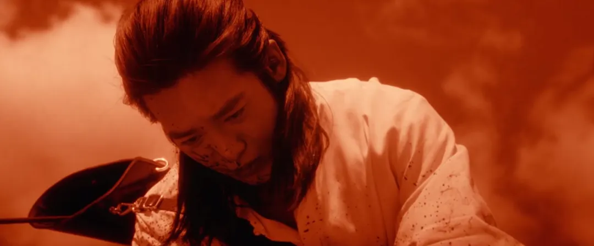
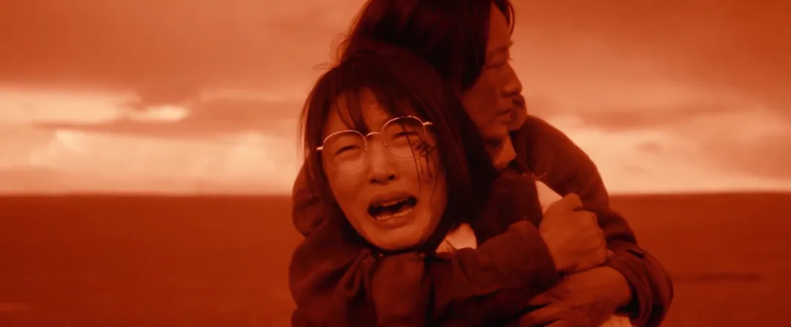

这是一部慢得不太像“国产剧”的国产剧。没有惊天动地的转折，也没有精心设计的爽点。

它讲的是一个女孩回到新疆阿勒泰，与母亲共同生活的故事。有人选择留下，有人想要离开；有人热烈地爱着，有人默默守护；有人挣扎着做选择，有人坦然面对别离。

它的节奏像风吹草原一样缓慢，却时不时让你心里“咯噔”一下；像是讲了一些不重要的小事，却总能撞上你心里那些不太好说出口的情绪。

你很难说这部剧“讲了一个什么完整的故事”，它更像是记录了一种**生活的质感**：  
那种你以为早就丢掉了的，真实、原始、不设防的生命力。

---

### **一、我们早就学会了想太多**

不是说自己有多聪明，而是这几年，活得太像在解题：

- 说句话得先掂量人设、立场、走向
    
- 跟人交往要设边界、做筛选、打标签
    
- 爱一个人都得先过三四道风控流程
    

哪怕只是别人笑一下，你脑子里都能推演出三种动机五种可能。

以前觉得这叫成熟，现在觉得这叫累。

我在看《我的阿勒泰》的时候突然想问：  
**我们到底是活着，还是在演“活着”这件事？**

---

### **二、那一箭，我没法忘**

那一箭，真的不是悲伤，是**震惊**。

踏雪不是被敌人杀的，不是意外死的，是被巴太亲手一箭穿喉的。

我们都知道那匹马对他意味着什么。

但他没哭，也没犹豫，就那么拉弓、放箭、低头收场。

不是因为“传统”或者“情怀”，而是他知道：

**到这一步了，非放不可了。**

我们呢？  
不是没遇到过必须放手的时候。  
只不过我们会拖、会绕、会装看不见。

—

城市不是问题，逻辑不是问题，  
问题是：**我们太怕承认结束。**

---

### **三、不是没情绪，是不会面对了**

剧里那些看起来“傻”的事：

- 把喝醉的陌生人带回家
    
- 借出一辈子积蓄就为了口头承诺
    
- 为一场临时婚礼倾尽所有
    

换成我们，谁敢？谁不是马上想“这人是不是想骗我”？  
可你说他们傻吗？也不是。只是他们还敢相信。

我们不是不相信，而是——  
我们**连被骗的资格都怕拥有**。

所以我们就用理性把情绪包起来，用推理掩盖信任，用计划隔绝痛苦。  
最后成了一个很冷静、很稳重，但也很难被真正触碰的人。

---

### **四、我们缺的，不是智慧，是“结束力”**

没人教我们怎么结束。

怎么收一段感情、怎么扔一个执念、怎么认输、怎么说“我不行了”。

所以我们啥都不结束，就堆着、藏着、绕着：

- 微信不删，聊天不回
    
- 工作不换，但天天内耗
    
- 人不爱了，还一起过节
    

我们以为“拖着”是缓冲，其实是慢性耗命。

阿勒泰那帮人，不是有多懂生死，是**太习惯面对“没办法”的时候了**。

所以才显得干净。

---

### **五、别再扛着了，试着练练放手**

你可以找个方式练习：

- 写一封信给过去的人，写完烧了
    
- 把旧照片丢进硬盘深处，别随便翻
    
- 找个好朋友，说一次：“我真的不行了。”
    

别装。  
我们都没那么坚强。

但也别怕。  
人生不是非要赢才能继续走。

你看巴太，踏雪死了，但他还得赶路。  
马鞍还在，草原还在，雪照样落下。

---

### **六、活成那样，不浪漫，但很实在**

张凤侠那句：“疼的时候就大声哭，但别耽误明天挤牛奶。”

我以前以为这句话太鸡汤。

现在懂了，这是活着最真实的状态——  
你可以崩溃，但不能一直躺着；  
你可以难过，但明天早上，太阳还会照样升起。

这剧教我的，不是“去做更好的人”，而是：

**别把“活下去”搞得那么复杂。**

有时候，活着就是该哭就哭，该放就放，然后接着走。

